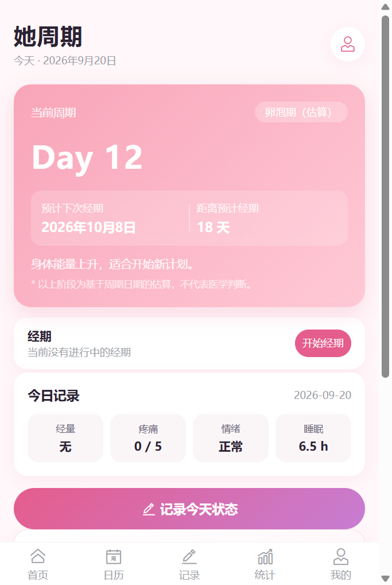
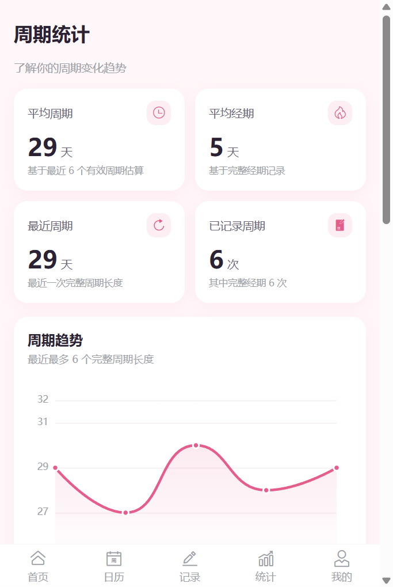
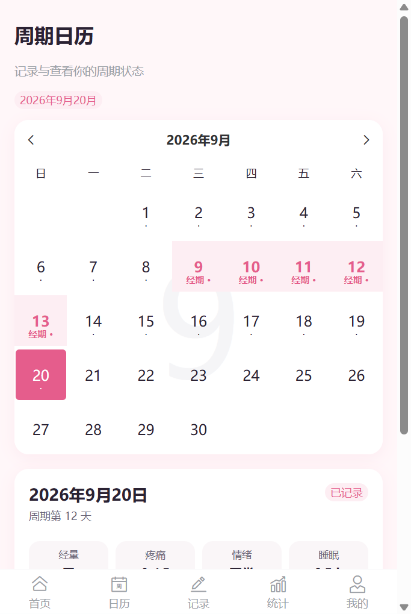
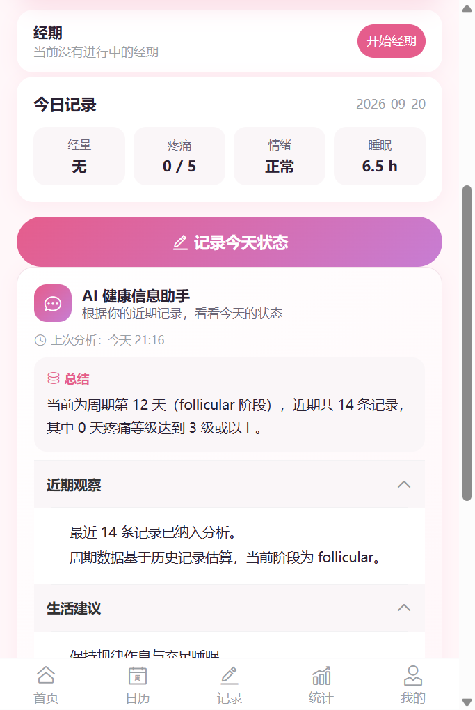
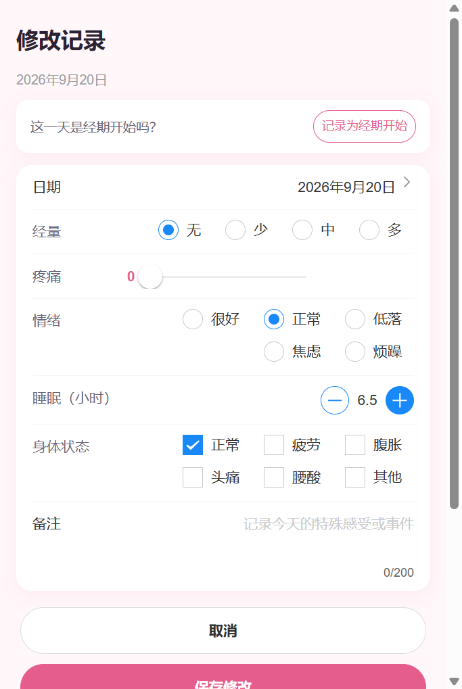

# 她周期 HerCycle

> AI 女性周期健康管理 App —— Vue 3 + FastAPI + DeepSeek 全栈项目（移动端优先）

## 项目简介

「她周期」是一款面向女性的个人周期健康记录与信息整理工具。用户可以记录经期起止日期、每日经量 / 疼痛 / 心情 / 睡眠 / 身体状态，并通过日历回顾、统计图表观察周期趋势；AI 助手基于用户**近期、最小范围**的数据生成健康信息总结、观察与一般性建议。

项目定位为**健康管理工具，不是医疗产品**：所有周期阶段均为日期算法估算并明确标注"（估算）"，AI 不进行疾病诊断、不推荐处方。

## 核心功能

- **真实经期管理**：开始 / 结束 / 修改 / 删除经期，进行中经期、未来日期、区间重叠等校验
- **日历回顾**：经期区间标记 + 每日健康记录标记，点击查看经期详情
- **健康记录**：经量、疼痛（0–5）、心情、睡眠、身体状态、备注，按日期唯一（upsert）
- **数据统计**：平均周期 / 经期长度、周期趋势折线、疼痛分布、情绪环形、身体状态分布（ECharts）
- **AI 健康信息分析**：总结 / 近期观察 / 生活建议 / 免责声明，分块折叠展示，记录上次分析时间
- **数据管理**：LocalStorage 本地持久化，一键清空全部数据（二次确认）
- **移动端体验**：Vant 组件库，针对 375 / 390 / 414 / 768px 适配，无横向滚动

## 技术栈

| 层级 | 技术 |
| --- | --- |
| 前端框架 | Vue 3 + TypeScript + Vite |
| 状态管理 | Pinia（LocalStorage 持久化） |
| 路由 | Vue Router 4 |
| UI 组件 | Vant 4（Tabbar / Popup / DatePicker / Collapse / Stepper…） |
| 图表 | ECharts 5 |
| HTTP | Axios |
| 后端 | FastAPI + Pydantic + Pydantic Settings + httpx |
| AI | DeepSeek API（deepseek-chat，JSON 输出模式） |

## 项目架构

```text
HerCycle/
├── src/                         # Vue3 前端
│   ├── api/ai.ts                # Axios 请求封装（仅 HTTP）
│   ├── components/              # CycleCard / AIHealthCard / 图表 / 表单等
│   ├── views/                   # Home / Calendar / Record / Statistics / Profile
│   ├── stores/cycle.ts          # Pinia：records / cycles / settings + 业务操作
│   ├── utils/                   # 纯函数：周期算法 / storage / payload 构造
│   ├── types/                   # 全局 TypeScript 类型
│   └── router/                  # 5 个 Tab 路由
└── backend/                     # FastAPI 后端
    ├── app/main.py              # 应用入口 / CORS / 统一异常处理 / health
    ├── app/config.py            # 环境变量配置（pydantic-settings）
    ├── app/routers/ai.py        # POST /api/ai/analyze
    ├── app/services/ai_service.py # SYSTEM_PROMPT / DeepSeek 调用 / Mock
    └── app/schemas/ai.py        # 请求/响应 Pydantic 模型
```

## 核心技术实现

### 1. 周期算法（`src/utils/cycleCalculator.ts`）

纯函数实现，不依赖框架，易测试：

```text
CyclePeriod[]
    ↓ 有效周期筛选（15–60 天，异常周期如 10 天被过滤）
    ↓ 周期长度计算（相邻两次经期开始日之差）
    ↓ 平均周期 / 平均经期
    ↓ 当前周期 Day（距最近一次经期开始日）
    ↓ 阶段估算（经期 / 卵泡期 / 排卵期附近 / 黄体期）
    ↓ 预计下次经期（数据不足时用默认 28 天，并标记"估算"）
```

边界处理：

- 只有一次经期：当前周期 Day 1，预计下次经期按默认周期估算并明确标记
- 异常周期（<15 或 >60 天）自动过滤，不污染平均值
- 未来日期不允许开始经期、不创建记录、不进入统计
- 删除经期后 Home / Calendar / Statistics / CycleCard 自动重算

### 2. 分层清晰的数据流

- **业务逻辑**全部收敛在 `utils/` 纯函数与 `store` 校验中，组件不重复实现规则
- 经期编辑组件**直接复用** `store.updatePeriod()` 的校验（未来日期 / 结束不早于开始 / 区间重叠 / 进行中唯一）
- Store 操作统一返回 `{ ok, message }`，组件据此 Toast 反馈
- Pinia `watch` 自动持久化到 LocalStorage，刷新浏览器数据不丢失

### 3. 图表可视化

通过 `composables/useECharts.ts` 统一管理 init / resize / dispose，Statistics 页面懒加载，包含：周期趋势折线、疼痛分布柱状、情绪环形、身体状态横向柱状；空数据时分级 Empty 提示，不出现 `undefined / NaN`。

## AI 能力

```text
Vue3（aiPayload.ts 构造最小请求体）
   ↓ Axios
FastAPI（/api/ai/analyze）
   ↓ httpx + response_format=json_object
DeepSeek API
   ↓ 严格 JSON
{ summary, observations, suggestions, disclaimer }
```

- **System Prompt 约束**：健康信息辅助助手定位；禁止诊断疾病 / 判断患病 / 推荐处方药 / 保证预测 / 编造数据；周期阶段均为日期算法估算；数据不足必须明确说明
- **健壮解析**：模型返回非合法 JSON 时容错提取，失败返回统一友好错误
- **Mock 模式**：未配置 Key 时可 `ENABLE_MOCK=true` 返回模拟数据，前端全流程可演示
- **前端体验**：idle / loading / success / error 四态，loading 期间禁止重复请求；空数据（无经期且无记录）前端拦截不发请求；结果分块 Collapse 折叠；展示"上次分析：今天 HH:mm"

### AI 数据最小化原则

发送给后端的数据严格受限，**不发送全部历史 / LocalStorage**：

| 数据 | 上限 |
| --- | --- |
| 当前周期 | 仅 `cycleDay` / `cycleLength` / `phase` 三个字段 |
| 最近健康记录 | 最多 **14 条**（每条备注截断 100 字） |
| 最近经期 | 最多 **3 次** |

### 安全：API Key 不进入前端

```text
DeepSeek API Key
      ↓ 仅保存在 backend/.env（已 gitignore）
   FastAPI 读取
      ↓
   DeepSeek API
```

前端源码、构建产物、README、Git 跟踪文件中均无 Key；后端错误响应不泄露 Traceback、请求头或原始异常。

## 本地运行（前端）

```bash
# Node 建议 18+（开发环境 Node 24）
npm install
npm run dev          # http://localhost:5173
npm run build        # 生产构建
npx vue-tsc --noEmit # 类型检查
```

## 后端运行

```bash
cd backend
python -m venv .venv
# Windows
.venv\Scripts\activate
# macOS / Linux
source .venv/bin/activate

pip install -r requirements.txt
uvicorn app.main:app --reload --port 8000
```

无 Key 时启用 Mock：

```bash
# backend/.env
ENABLE_MOCK=true
```

## 环境变量

前端（复制 `.env.example` 为 `.env.local`，不提交）：

```env
VITE_API_BASE_URL=http://localhost:8000
# 真机调试改用局域网 IP：
# VITE_API_BASE_URL=http://192.168.x.x:8000
```

后端（复制 `backend/.env.example` 为 `backend/.env`，不提交）：

```env
DEEPSEEK_API_KEY=sk-your-key
ENABLE_MOCK=false
```

API：

- `GET /api/health` → `{"status":"ok"}`
- `GET /api/health/ai` → `{"enabled":true,"mock":false}`（不返回任何 Key 信息）
- `POST /api/ai/analyze` → AI 分析结果

## 项目截图

| 首页 | 统计 |
| --- | --- |
|  |  |
| **日历** | **AI 健康信息分析** |
|  |  |
| **健康记录** | |
|  | |

## 项目亮点

1. **Vue 3 工程化完整**：Composition API + 严格 TypeScript + Pinia + Vue Router + Vant + ECharts + Axios，分层清晰（api / stores / utils / components / views）
2. **可测试的周期算法**：有效周期筛选 → 长度计算 → 平均 → 当前 Day → 阶段 → 趋势，纯函数实现并覆盖单周期 / 异常周期 / 未来日期等边界
3. **前后端分离**：Vue3 ↔ Axios ↔ FastAPI ↔ AI Service ↔ DeepSeek，后端薄路由 + Service 分层
4. **AI 数据最小化**：仅发送 14 条健康记录、3 次经期与当前周期 3 个字段，兼顾实用性与隐私
5. **安全意识**：API Key 只存后端环境变量，统一 `{"message"}` 错误响应，构建产物无敏感信息

## 后续规划

- 周期提醒（本地通知）
- 体重 / 体温等更多记录维度
- AI 分析结果本地历史
- PWA 离线安装

> 按当前定位，暂不引入登录系统、云数据库、社交、医疗诊断模型等重功能。

## 免责声明

本应用仅用于个人健康记录和信息整理，不用于疾病诊断、治疗或医疗决策。AI 输出内容仅作健康信息参考，不构成医疗建议；如出现持续或异常症状，请咨询专业医疗人员。
